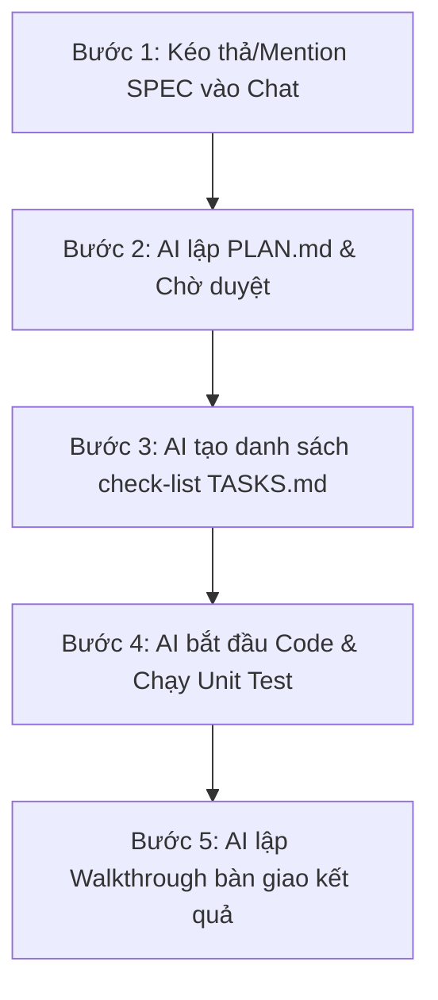

# Cẩm Nang Quy Trình Lập Trình Spec-Driven Development (SDD) cùng AI

Tài liệu này hướng dẫn cách Lập trình viên tương tác với AI Agent để triển khai các tính năng mới hoặc sửa lỗi trong dự án Gia Hoa Phát một cách khoa học, sạch sẽ và không bao giờ bị lệch cấu trúc.

---

## Quy Trình 5 Bước Triển Khai Tính Năng (Implementation Loop)

Khi bạn muốn triển khai một tính năng mới, hãy thực hiện tuần tự theo luồng sau:

---

### Bước 1: Đưa Đặc Tả (Spec) làm Bối Cảnh (Context)
Không bao giờ yêu cầu AI viết code chung chung. Hãy mention trực tiếp file Spec tương ứng làm "nguồn chân lý".
*   **Cách chat với AI**:
    > "Hãy triển khai tính năng nạp tiền ví dựa trên đặc tả của @[SPEC.md] này."

---

### Bước 2: AI lập Kế hoạch triển khai (`PLAN.md`)
AI sẽ không viết code ngay lập tức. Đầu tiên, AI sẽ phân tích Spec và tạo ra một tệp kế hoạch đặt tại thư mục tính năng (hoặc `implementation_plan.md` ở root).
*   **Nội dung Plan**: Liệt kê chi tiết các lớp Java/HTML/CSS/JS cần tạo mới `[NEW]` hoặc chỉnh sửa `[MODIFY]`.
*   **Hành động của bạn**: Đọc qua danh sách các file AI dự kiến sửa, nếu đồng ý thì gõ "Proceed" hoặc nhấn nút **Proceed** trên UI của IDE để cấp quyền.

---

### Bước 3: AI lập Danh sách việc cần làm (`TASKS.md`)
Khi kế hoạch được duyệt, AI tự động tạo tệp `TASKS.md` (hoặc `task.md` ở root/artifacts) trong thư mục tính năng tương ứng.
*   **Trạng thái Task**:
    *   `- [ ] Task chưa thực hiện`
    *   `- [/] Task đang thực hiện` (AI sẽ đổi thành cờ này khi đang viết code file đó)
    *   `- [x] Task đã hoàn thành`
*   **Mục đích**: Giúp bạn nhìn thấy AI đang code đến đâu trong thời gian thực, không bị lạc mất tiến độ.

---

### Bước 4: AI viết Code & Kiểm thử tự động (Execution)
AI thực hiện sửa đổi các file mã nguồn.
*   **Kiểm thử**: AI tự động viết integration test/unit test tương ứng và chạy lệnh build/test để xác nhận code chạy ổn định.

---

### Bước 5: Bàn giao và nghiệm thu (`walkthrough.md`)
Khi tất cả các đầu việc đã chuyển sang trạng thái hoàn thành `[x]`, AI sẽ:
1.  Tạo tệp `walkthrough.md` tổng kết các file đã sửa đổi, mã kiểm thử đã chạy thành công.
2.  Đưa ra kịch bản chạy thử nghiệm thực tế để bạn kiểm tra.
