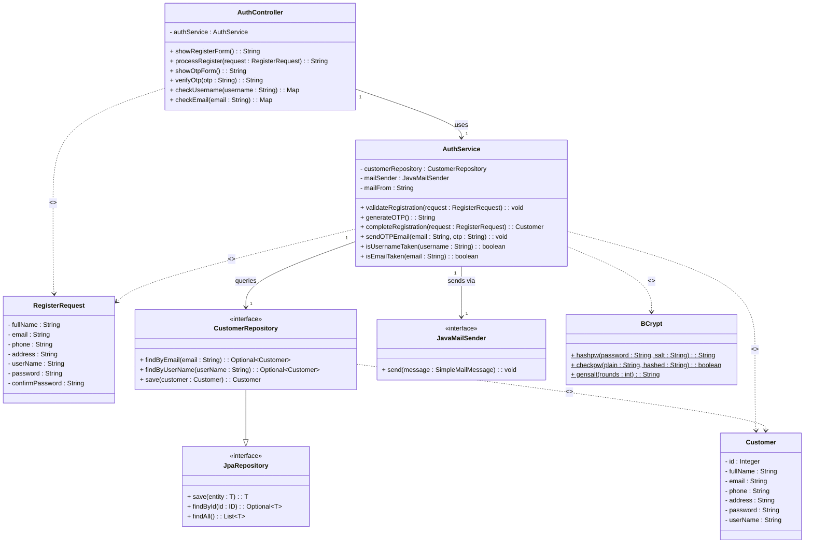

# Class Diagram — Đăng ký tài khoản (Register)
> Chuẩn UML — Section 2.4, Figure 2.3 & 2.4
> Phiên bản v4 — đã sửa 4 lỗi so với v3

---

## Class Diagram

---

## Tổng hợp 4 lỗi đã sửa (v3 → v4)

| # | Lỗi trong v3 | Sửa trong v4 | Lý do UML |
|---|---|---|---|
| 1 | `AuthController` không có attribute `authService` | Thêm `- authService : AuthService` | Field lưu trong class phải khai báo trong ngăn attributes (Figure 2.4) |
| 2 | `AuthService` thiếu `customerRepository`, `mailSender` | Thêm cả 2 vào ngăn attributes | Idem — field được inject qua constructor phải hiện trong class box |
| 3 | `BCrypt` methods không có ký hiệu static | Thêm `$` vào cuối mỗi method | UML: static member được gạch chân; Mermaid dùng `$` |
| 4 | (đã đúng) `CustomerRepository --|> JpaRepository` | Giữ nguyên Generalization | `interface extends interface` → đúng là Generalization (hollow arrow) |

---

## Bảng quan hệ theo sách (Figure 2.3)

| Quan hệ | Ký hiệu UML | Áp dụng trong diagram |
|---|---|---|
| **Association** | `──────►` solid + multiplicity | Controller→Service, Service→Repo, Service→Mail |
| **Generalization** | `──────▷` hollow arrowhead | `CustomerRepository ──▷ JpaRepository` |
| **Dependency** | `- - - -►` dashed | Controller→RegisterRequest, Service→Customer, Service→BCrypt |

---

## Multiplicity

| Đường nối | Multiplicity | Giải thích |
|---|---|---|
| `AuthController "1" → "1" AuthService` | 1:1 | 1 Controller inject đúng 1 Service |
| `AuthService "1" → "1" CustomerRepository` | 1:1 | 1 Service inject đúng 1 Repository |
| `AuthService "1" → "1" JavaMailSender` | 1:1 | 1 Service inject đúng 1 MailSender |
